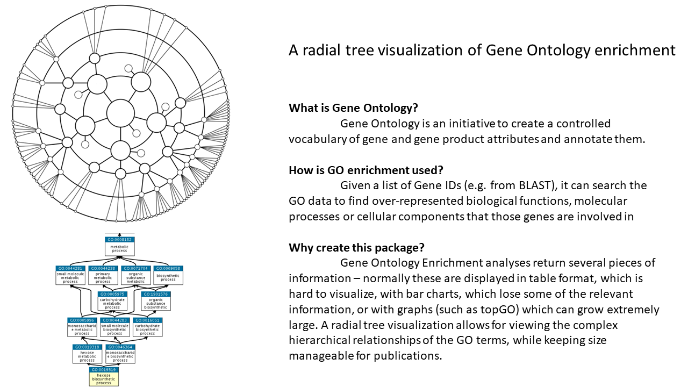

# RadialGO
## A radial tree visualization for Gene Ontology enrichment analysis

The goal of this package is to provide a visualization of GO enrichment analysis
in a radial tree format.

## Installation

You can install the latest version using
``` r 
require("devtools")
install_github("brucosper/RadialGO")
library("RadialGO")
```

## Overview



## Contributions

The author of the package is Bruno Pereira. The functions available within this 
package include. 

``` r 
library("RadialGO")
lsf.str("package:RadialGO")
```

- generateGraph
- rebuildGOID

The generateGraph function was authored by Bruno Pereira. It uses the DiagrammeR
package for generating graphical output.
The GO.db and the AnnotationDbi packages were used to retrieve information about
GO terms. The invert function in the searchable package was used for 
facilitating data retrieval from a named numerical vector .
